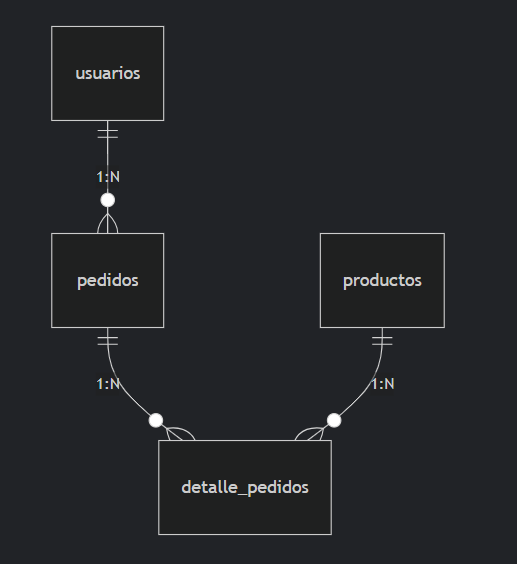

# 🛒 tienda-backend  

Backend para una tienda online (ejemplo).  

## Estructura del proyecto  
- `src/`: Lógica principal (controladores, modelos, rutas).
- `database/`: Scripts SQL.
- `public/`: Archivos accesibles públicamente.

## Tecnologías
- Node.js/Express (o PHP, según tu stack).
- MySQL/PostgreSQL.

## Diagrama

## erDiagram
- usuarios ||--o{ pedidos : "1:N"
- pedidos ||--o{ detalle_pedidos : "1:N"
- productos ||--o{ detalle_pedidos : "1:N"

## Endpoint: 
    GET /productos
    POST /productos

## Autor
Cristian Jacson Valdivieso Valenzuela